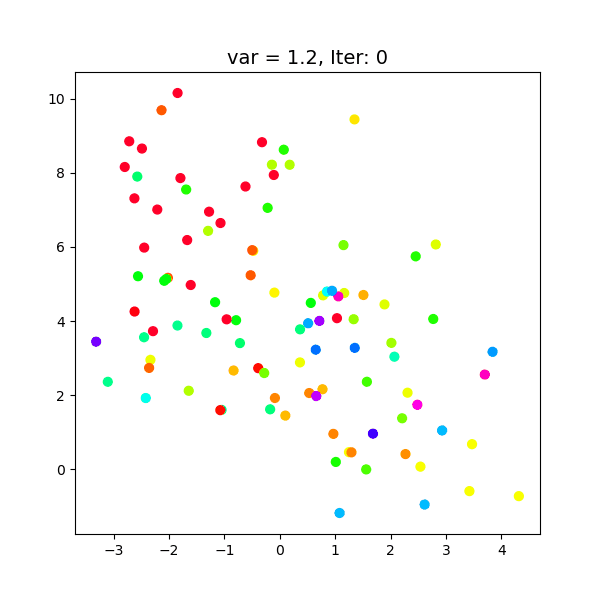

# Slicer sampler - a non-parametric Bayesian clustering algorithm

Implementation of Slice sampler to cluster data with unspecified number of classes as a part of a bigger project on non-parametric clustering algorithms.

The code is structured as followes:

1. `slicer_func.py` - Step by step functions and implementation of a Slicer Algorithm as introduced in [Walker (2009)]({https://doi.org/10.1007/s11222-009-9150-y})
2. `slice_sampler.py` - Analysis of algorithm on Gaussian data with different variance (overlap)
3. `graph_func.py` - Helper functions for visualizations.

Visualization of clustering process in time:

